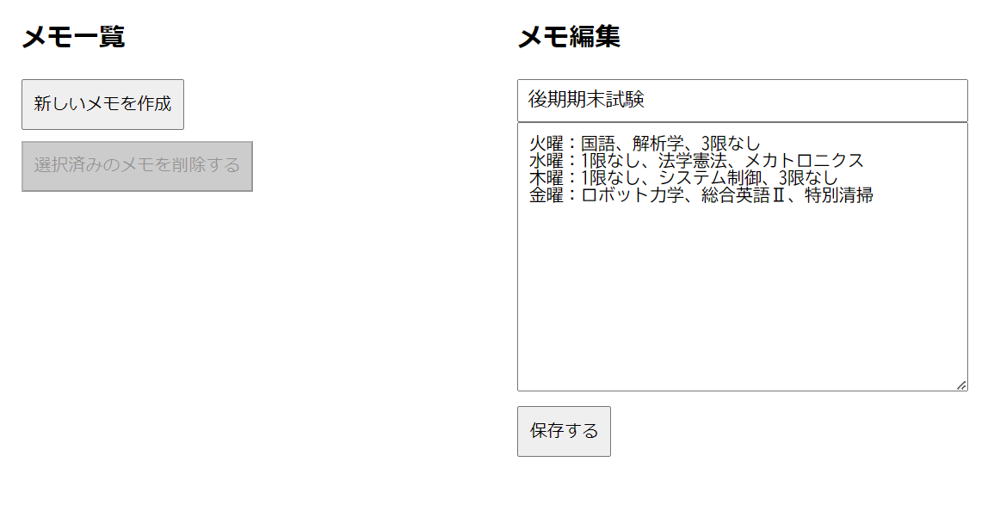
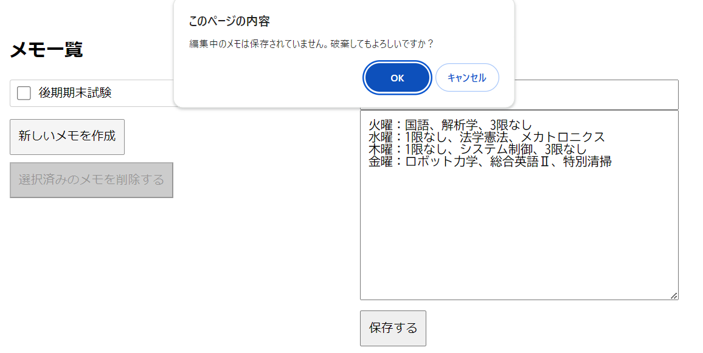

# メモアプリ

## 使用方法

画面右側にタイトル（100字以内）と内容（1000字以内）を入力し、保存ボタンを押す

保存ボタンが押されると、画面左のメモ一覧に追加され、メモのタイトルが表示される

タイトルをクリックすると、入力にメモの情報が出力され、編集できるようになる

新しいメモを作成のボタンを押すと入力状況がリセットされ、新規のエモを作成できるようになる

## 工夫点

メモ一覧の左にチェックボックスを追加し、選択したメモを削除できるようにした

編集していたメモを保存しないまま別のメモや新規メモを作成する恐れがあるとして、編集していたメモが編集前と比較し、変更があった場合は、確認のアラートを表示させた

